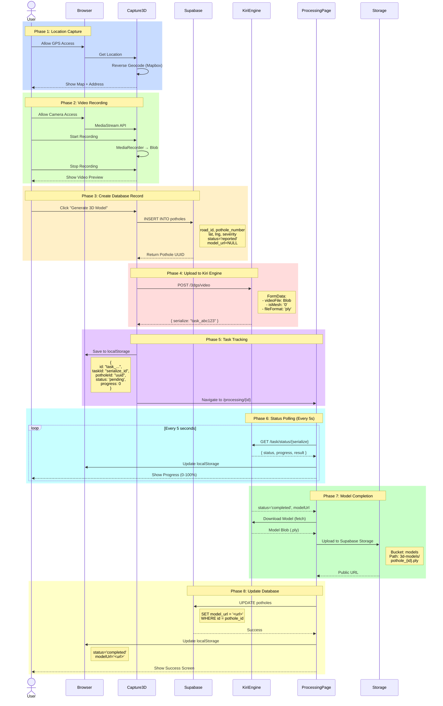
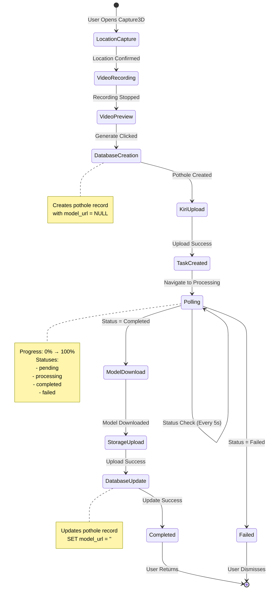
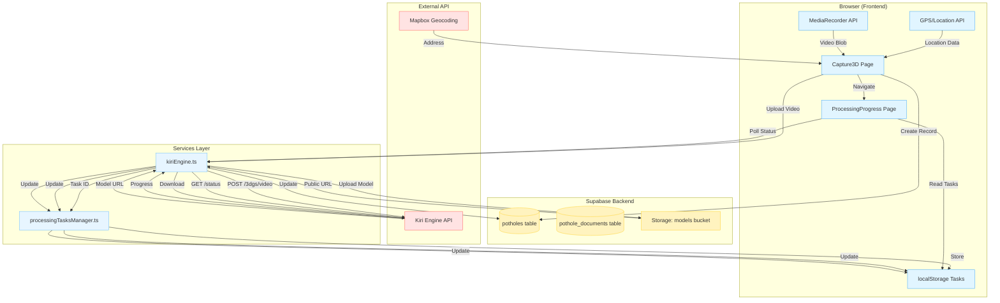
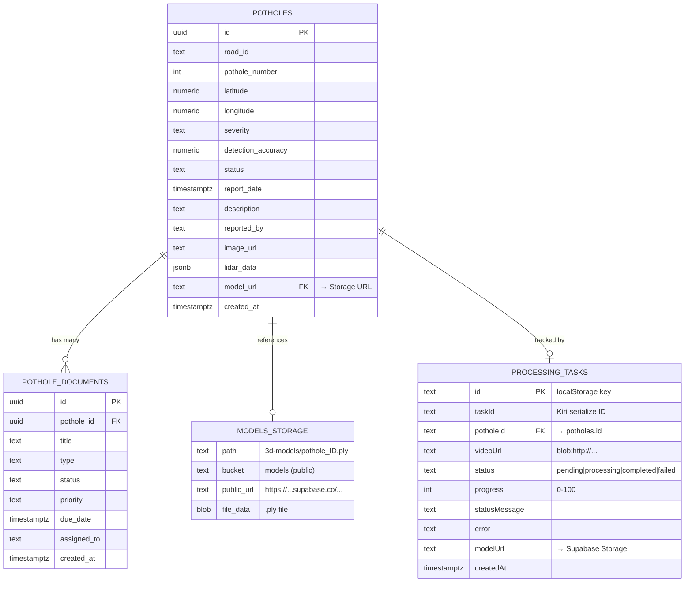
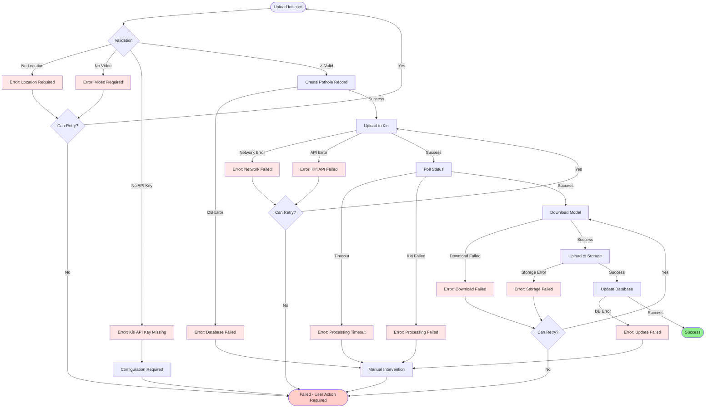
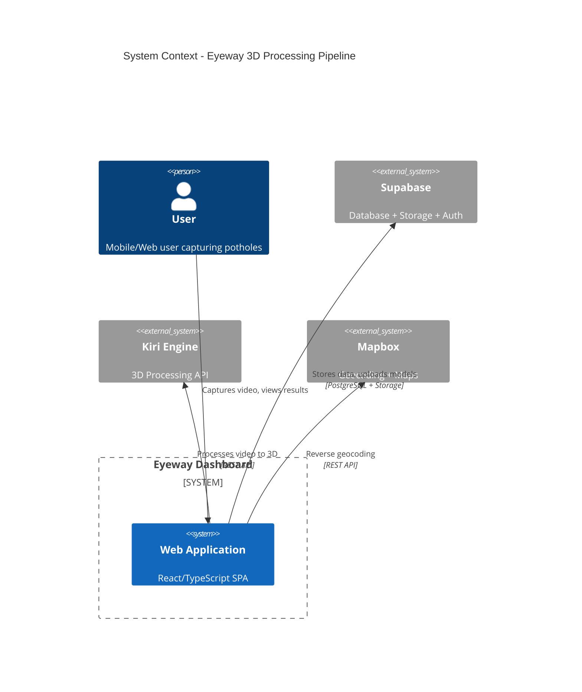

# Data Flow Diagram - Visual Guide

## Complete Upload to Processing Flow



---

## State Machine Diagram



---

## Component Interaction Diagram



---

## Data Storage Architecture



---

## File Upload Flow

```mermaid
flowchart TD
    Start([User Captures Video]) --> Check{Video Source?}
    
    Check -->|Camera| Record[MediaRecorder API]
    Check -->|File Upload| FileInput[<input type='file'>]
    
    Record --> Blob1[Video Blob in Memory]
    FileInput --> Blob2[File as Blob]
    
    Blob1 --> CreateDB[Create Pothole in DB]
    Blob2 --> CreateDB
    
    CreateDB --> GetID[Get Pothole UUID]
    GetID --> PrepareUpload[Prepare FormData]
    
    PrepareUpload --> KiriUpload{Kiri Engine Upload}
    
    KiriUpload -->|Success| TaskID[Get Task Serialize ID]
    KiriUpload -->|Error| ErrorHandler[Show Error Toast]
    
    TaskID --> SaveLocal[Save to localStorage]
    SaveLocal --> Navigate[Navigate to /processing]
    
    Navigate --> Poll{Poll Status Every 5s}
    
    Poll -->|pending/processing| UpdateProgress[Update Progress Bar]
    UpdateProgress --> Poll
    
    Poll -->|completed| Download[Download Model from Kiri]
    Poll -->|failed| ShowError[Show Error Message]
    
    Download --> UploadSupabase[Upload to Supabase Storage]
    UploadSupabase --> GetURL[Get Public URL]
    GetURL --> UpdateDB[Update potholes.model_url]
    UpdateDB --> UpdateLocal[Update localStorage]
    UpdateLocal --> Success([Show Success Screen])
    
    ErrorHandler --> End([End])
    ShowError --> End
    Success --> End
    
    style Start fill:#90ee90
    style Success fill:#90ee90
    style End fill:#ffcccb
    style ErrorHandler fill:#ffcccb
    style ShowError fill:#ffcccb
    style Poll fill:#add8e6
    style KiriUpload fill:#ffd700
```



---

## Error Handling Flow



---

## Progress Tracking Logic

```mermaid
gantt
    title 3D Model Processing Timeline
    dateFormat  X
    axisFormat %s
    
    section Upload
    Create Pothole Record    :0, 5s
    Upload to Kiri Engine    :5s, 15s
    Create Task Tracking     :15s, 20s
    
    section Processing
    Kiri: Upload Complete    :20s, 30s
    Kiri: Frame Extraction   :30s, 90s
    Kiri: Point Cloud Gen    :90s, 180s
    Kiri: 3DGS Model Gen     :180s, 300s
    
    section Storage
    Download Model           :300s, 315s
    Upload to Supabase       :315s, 330s
    Update Database          :330s, 335s
    Update Task Status       :335s, 340s
    
    section Display
    Show Success Screen      :340s, 345s
```

---

## System Context Diagram



---

*These diagrams can be rendered using Mermaid-compatible tools like:*
- *GitHub (auto-renders in .md files)*
- *Mermaid Live Editor (https://mermaid.live)*
- *VS Code Mermaid Extension*
- *Notion, Obsidian, etc.*

---

*Last Updated: October 14, 2025*

